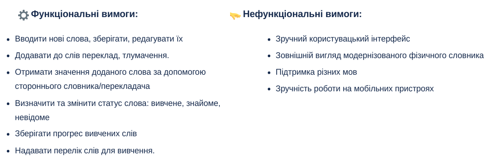

# Wordum

## Про проект

## Вимоги користувачів

## Загальна архітектура

## Архітектура класів

## Архітектура View

## Головна сторінка
Користувач отримує нове слово для вивчення, він вказує чи він знає його, якщо ні, то воно додається в словник.

## Словник
Користувач може додати, видалити слова для вивчення, при цьому він отримає переклад слова яке він не знає на обраній ним мові.

## Перекладач
Користувач може додати, перекладати текст, на будь якій мові з більше 135-ти.

## Налаштування
Тут користувач може обрати мову для автоматичного/ручного перекладу слів, а також змінити зовнішній вигляд застосунку.

## Відео презентація

<video width="640" height="360" controls>
  <source src="vertopal_192a9fb41ab64d2ba734008e0e9b9999/media/video_presentation.mp4" type="video/mp4">
  Your browser does not support the video tag.
</video>